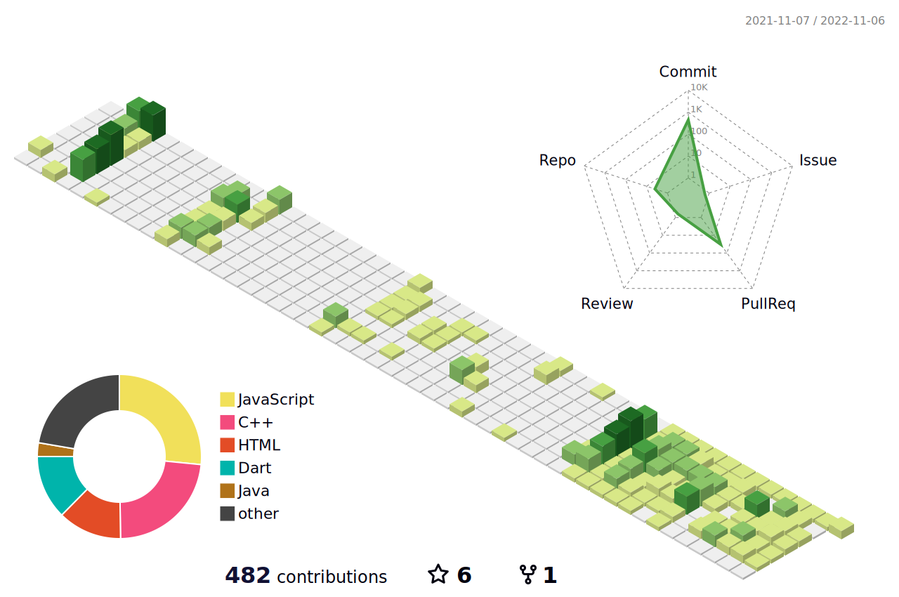

<h3 align="center">🛠 Tech Stack</h3>

 My main skills are... 

  
  
  

 I have learned 

  </a>&nbsp 
  </a>&nbsp 
  </a>&nbsp 
  </a>&nbsp 
  </a>&nbsp
   
  </a>&nbsp 
  </a>&nbsp 
  </a>&nbsp 
  </a>&nbsp 
  </a>&nbsp
  </a>&nbsp 

 
___

  &nbsp
  &nbsp
  
  
  

 

<!--

  

<!--
**minsuhan1/minsuhan1** is a ✨ _special_ ✨ repository because its `README.md` (this file) appears on your GitHub profile.

Here are some ideas to get you started:

- 🔭 I’m currently working on ...
- 🌱 I’m currently learning ...
- 👯 I’m looking to collaborate on ...
- 🤔 I’m looking for help with ...
- 💬 Ask me about ...
- 📫 How to reach me: ...
- 😄 Pronouns: ...
- ⚡ Fun fact: ...
-->
